---
layout: post
title: Optimising Matrix Multiplication Using Top Down Analysis
toc: true 
categories: [Performance Engineering, Performance Optimization]
excerpt: In this article I am going to look in to how we can use Top Down microarchitectural analysis method to drive some typical optimizations for matrix multiplication. 
--- 
## Introduction

Matrix multiplication (in general `gemm` in BLAS) is one of the most performance
critical compute kernels operating at the heart of many scientific computing and
deep learning workloads. While highly optimized BLAS implementations of this
kernel are available, it is still useful to understand some of the typical
optimizations which can be used to improve a naive matrix multiplication
implementation. In this article I am going to look in to how we can optimize a
matrix multiplication kernel on x86 starting from a naive implementation.

I am going to use Top Down performance analysis which is available within Intel
Vtune profiler and observe performance characterisitcs of the kernel at each
stage and drive the optimizations accordingly. I have covered Top Down in a
previous article which also contains many good references on how to get started
with it. The idea here is to illustrate how we can use this method to drive
optimizations, using matrix multiplication as a case study.  Beating existing
highly tuned `gemm` kernels is a non goal for this article.  Interested readers
can find relatively recent work on high performance `gemm` implementations at
[1], [2]. The target audience for this article is beginner to intermediate level
readers.

## Setup

The system used was a Skylake i7-8750H 2.2GHz, with 64GB memory and running a
Linux 4.15.0-43 kernel. Benchmarks were run with SMT (hyperthreading) enabled,
but with frequency scaling and turbo boost disabled. All code was compiled with
gcc 6.4.0 at default -O2 optimization level.

## Baseline

Here I am going to implement the `dgemm` operation `C = A * B + C`.  For this
experiment I chose all square matrices with type `double`, having dimensions `4096 x
4096`. All the matrices are allocated with a cache line alignment.  



For the base line comparison I am going use the Intel Math Kernel Library dgemm
implementation. The MKL `dgemm` implementation took `4.32` seconds on system under
test (additional metrics in side bar). Let's see how close to its
performance we can get with our incremental optimizations.  

I start with the typical naive implementation featuring three nested loops.



```
for (int i = 0; i < N; i++) {
  for (int j = 0; j < N; j++) {
    for (int k = 0; k < N; k++) {
      C[i][j] += A[i][k] * B[k][j]
    }
  }
} 
```



After running it with profiling enabled, VTune top down view gives us the
following (partly redacted to show the interesting sections).

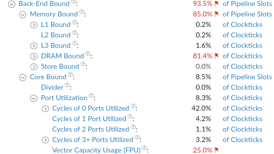



The implementation is heavily bottlenecked on memory as evident from `Memory Bound`
statistics. The matrices are in row-major order in memory. So as shown in
figure below, every column sweep of B is accessing a new cache line going down.
Only one element in the fetched cache line is used in the computation before 
moving on to the next cache line. 


{% include marginnote.html title="Metrics" color="#ff009b" 
content="<p style=\"margin-left:5px;margin-bottom:0px;\">Time(s) &nbsp; &nbsp; &nbsp; &nbsp; : 810.81 
<i class=\"arrow-up\" style=\"--color:red;--size:8px;\"></i></p>
<p style=\"margin-left:5px;margin-top:0px;margin-bottom:0px;\">CPI &nbsp; &nbsp; &nbsp; &nbsp; &nbsp; &nbsp; &nbsp; &nbsp;: 3.569 
<i class=\"arrow-up\" style=\"--color:red;--size:8px;\"></i></p>
<p style=\"margin-left:5px;margin-top:0px;\">(impl/base) : 187.69x 
<!--<i class=\"arrow-up\" style=\"--color:red;--size:8px;\"></i>--></p>
"%}

Our naive implementation takes `810.81` seconds which is a whopping `187.69`
times slower than the MKL `dgemm` implementation. Here we can see the secondary
effects of memory pressure from the Top Down output. The `Port Utilization` is
poor with 42% of clock ticks going without any execution port used. A high `CPI`
value of 1.4 (see sidebar for additional metrics) also indicates we are
potentially experiencing memory stalls (modern super scalar CPUs can
theoritically retire 4 uops per cycle giving an optimal CPI of 0.25). 

## Optimizations

We need to optimise the memory access pattern of the naive implementation in
order to maximise the amount of computation done before relinquishing a cache
line fetched from B.  The typical first order memory optimization for matrix
multiplication is cache blocking.

### Cache Blocking (Tiling)



With cache blocking (aka tiling) we fetch block of each matrix at a time and
carry out multiplication at block level. The fetched blocks are mostly served
from the fast memory (caches) and we reduce the number of main memory accesses incured per floating point operation. Figure below illustrates the simple blocking pattern I used for the computation where each matrix is blocked with a uniform block size. After an experimental performance verification I picked a block size of `256` elements for this implementaton.

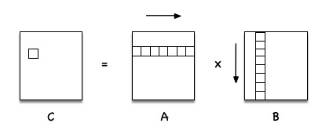

Below is the Top Down comparative output with the naive implementation (native
on left).

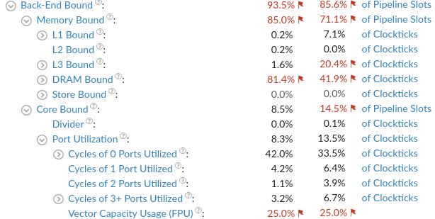

{% include marginnote.html title="Metrics" color="#ff009b" 
content="<p style=\"margin-left:5px;margin-bottom:0px;\">Time(s) &nbsp; &nbsp; &nbsp; &nbsp; : 364.78 
<i class=\"arrow-down\" style=\"--color:green;--size:8px;\"></i></p>
<p style=\"margin-left:5px;margin-top:0px;margin-bottom:0px;\">CPI &nbsp; &nbsp; &nbsp; &nbsp; &nbsp; &nbsp; &nbsp; &nbsp;: 1.616 
<i class=\"arrow-down\" style=\"--color:green;--size:8px;\"></i></p>
<p style=\"margin-left:5px;margin-top:0px;\">(impl/base) : 84.43x 
<i class=\"arrow-down\" style=\"--color:green;--size:8px;\"></i></p>
"%}

Apart from the drastic reduction of run-time to `364.78` seconds we can also
immediately see that memory pressure has been shifted upwards in the hierarchy,
where `DRAM Bound` cycles have halved while `L3 Bound` cycles have gone up. The
`Port Utiliazation` also has edged up from 8.5% to 13.5%. Correspondingly we can
see the `CPI` has also somewhat improved to `1.616`. 

<!--
"<div><div class=\"arrow-down\" style=\"--color:#f00; --size:8px;\"></div>Time(s): -5%</div>
         <div><div class=\"arrow-up\" style=\"--color:green; --size:8px;\"></div>CPI : 5%</div>" 
-->

Given `~42%` of cycles are still `DRAM Bound` there is more performance headroom
achievable with memory optimizations. So now we test another typical memory
optimization -- changing the loop iteration order.


### Loop Interchange 

In our current block multiplication (sub) kernel we still have the sub-optimal
column sweep memory access pattern at B. If we interchange the two inner loops
in this kernel we change the access pattern so that we access B linearly. Figure
below shows the new memory access pattern.

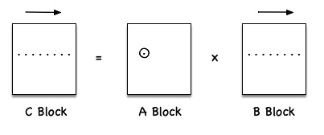



Now we have to do multiple passes over a row of `C` in order to fully compute a
value for a given `C_{ij}` cell instead of calculating the cell values one at a
time.  Using one `$ A_{ij}` $ cell we sweep both `C` and `B` rows to compute
partial `C_{ij}` values involving that particular `A_{ij}` cell. As shown in the
next figure below, in order to process `A_{i,j+1}` cell we fetch the
next row of `B` and carry out another row sweep on `C` and `B`. The important
thing to note here is that all computation is now reorganized so that memory
accesses happen row-wise across all matrices. 

{% include marginnote.html title="Metrics" color="#ff009b"
content="<p style=\"margin-left:5px;margin-bottom:0px;\">Time(s) &nbsp; &nbsp;
&nbsp; &nbsp; : 83.46 
<i class=\"arrow-down\" style=\"--color:green;--size:8px;\"></i></p>
<p style=\"margin-left:5px;margin-top:0px;margin-bottom:0px;\">CPI &nbsp; &nbsp;
&nbsp; &nbsp; &nbsp; &nbsp; &nbsp; &nbsp;: 0.38 
<i class=\"arrow-down\" style=\"--color:green;--size:8px;\"></i></p>
<p style=\"margin-left:5px;margin-top:0px;\">(impl/base) : 19.32x
<i class=\"arrow-down\" style=\"--color:green;--size:8px;\"></i></p>
"%}

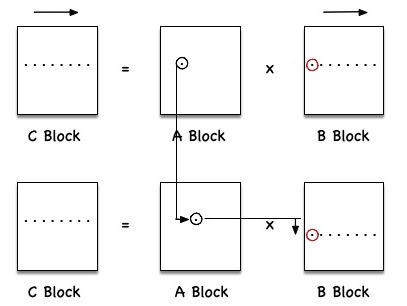

The new Top Down output shows a marked reduction of memory pressure as compared
our previous implementation.

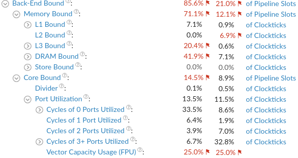


Both `DRAM Bound` and `L3 Bound` cycles has significantly reduced. We also see
that zero `Port Utilization` levels has been reduced. The `CPI (0.38)` is now pretty
close to that of `dgemm` implementation. More importantly, now our run time is 
down to `~83` seconds which is more than 4x faster than the blocked
implementation.

With above first order memory optimizations away, we now focus our attention on
optimizing the compute efficiency (i.e: `Port Utilization`).

### Hoisting Indexing

After cache blocking, the computation in the inner most loop looks as below. 

```
  C[N * (i + ib) + (j + jb)] +=
                  A[N * (i + ib) + (k + kb)] * B[N * (k + kb) + (j + jb)]
```



Here `N` is the matrix size with `i,j,k` being block indices and `ib,jb,kb`
being intra block indices. Most of these index calculations are happening
repeatedly in this loop body, so they are good candidates for loop hoisting.

After loop hoisting the innermost loop body simplifies to the following.

```
  C[jb] += A[k + kb] * B[jb]
```

{% include marginnote.html title="Metrics" color="#ff009b"
content="<p style=\"margin-left:5px;margin-bottom:0px;\">Time(s) &nbsp; &nbsp;
&nbsp; &nbsp; : 82.53 
<i class=\"arrow-down\" style=\"--color:green;--size:8px;\"></i></p>
<p style=\"margin-left:5px;margin-top:0px;margin-bottom:0px;\">CPI &nbsp; &nbsp;
&nbsp; &nbsp; &nbsp; &nbsp; &nbsp; &nbsp;: 0.375
<i class=\"arrow-down\" style=\"--color:green;--size:8px;\"></i></p>
<p style=\"margin-left:5px;margin-top:0px;\">(impl/base) : 19.10x
<i class=\"arrow-down\" style=\"--color:green;--size:8px;\"></i></p>
"%}


The new Top Down ouput is as below.

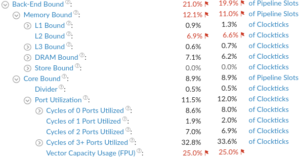


According to Top Down, there is a slight improvement in `Port Utilization` and
`Memory Bound` metrics due to this change. We have slightly improved the `CPI`
metric as well. However the effect on runtime was small. 

### Vectorization



So far we haven't utilized vectorization capabilities available in the system.
The system under test features AVX2 capabilities with 256 bit width SIMD
operations which we have not utilized as yet. Due to this, the Top Down
output flags low `Vector Capacity Usage` as a potential bottleneck. Fortunately, 
we can easily vectorize the inner loop computation with a FMA (fused-multiply-add)
operation available with  `_mm256_fmadd_pd` AVX2 intrinsic. 


{% include marginnote.html title="Metrics" color="#ff009b"
content="<p style=\"margin-left:5px;margin-bottom:0px;\">Time(s) &nbsp; &nbsp;
&nbsp; &nbsp; : 33.63 &nbsp;
<i class=\"arrow-down\" style=\"--color:green;--size:8px;\"></i></p>
<p style=\"margin-left:5px;margin-top:0px;margin-bottom:0px;\">CPI &nbsp; &nbsp;
&nbsp; &nbsp; &nbsp; &nbsp; &nbsp; &nbsp;: 0.677 &nbsp;
<i class=\"arrow-up\" style=\"--color:red;--size:8px;\"></i></p>
<p style=\"margin-left:5px;margin-top:0px;\">(impl/base) : 7.78x &nbsp;
<i class=\"arrow-down\" style=\"--color:green;--size:8px;\"></i></p>
"%}

With this change, we reduce the runtime to around `33` seconds. Eventhough we
have obtained a `~2.5x` runtime reduction it is considerably sub linear, given
that we process 4 floating point elements at a time. This is a potential
indicator that the bottleneck is now shifted back to memory so that increasing
amount of instructions are now getting memory stalled. The Top Down output for
our vectorized implementation confirms this hypothesis. 

As shown in the figure below, both `L3 Bound` and `DRAM Bound` cycles have
increased. However here we note that even though `CPI` has doubled we cannot
completely attribute it to memory stalls since vector operations are higher in
latency, thus  driving the `CPI` higher. More importantly, we can see now
`Vector Capcity Usage` has significantly improved so that Top Down does not flag
it as a potential bottleneck anymore. 

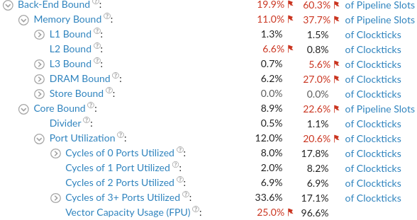


### Prefetching 

Let's see if we can improve cache utilization using our next trick -- software
prefetching. Here it helps to understand the memory access patterns of each
matrix involved. With loop interchange we currently have the following access
pattern.

```
For one row sweep of C we do a row sweep of A and a whole block sweep of B. Also
We only read a block of A once with no reuse.
```  



This suggests that we could do a non temporal memory prefetch on A so that we
can fetch and use A's cache lines without polluting the regular caches. We can
also experiment prefetching B with a suitable prefetch distance. I experiemented with several, 
including 4 and 8 cachelines ahead.

However, I did not see any discernible performance improvment with prefetching
used as above. While as to why requires more in-depth analysis, the previous
Top Down output for the vectorized version provides a hint, where it shows latency in L3 
bound instructions reaching to 100%. 

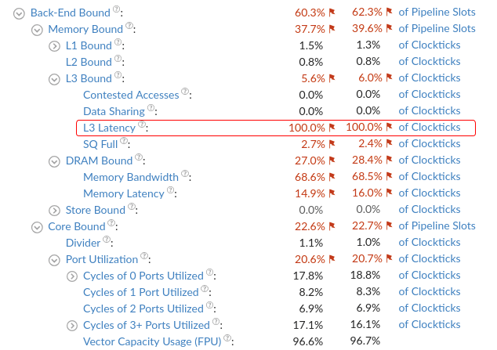

With the usage of SIMD instructions we are 
reaching the bandwidth limits between the caches and main memory so any
additional prefetching is bottlenecked at this point. Hence I disable this
optimization in the next iterations below.


### Loop Unrolling



Loop unrolling is a typical optimization which helps reduce loop control
related costs. It also enables new down-stream optimizations like instruction
scheduling where we can re-order load and compute instructions for better execution
port utilization.  Here I found out that manually unrolling the inner-most loop by a
factor of 4 gives the best run-time reduction.

{% include marginnote.html title="Metrics" color="#ff009b"
content="<p style=\"margin-left:5px;margin-bottom:0px;\">Time(s) &nbsp; &nbsp;
&nbsp; &nbsp; : 27.64 &nbsp;
<i class=\"arrow-down\" style=\"--color:green;--size:8px;\"></i></p>
<p style=\"margin-left:5px;margin-top:0px;margin-bottom:0px;\">CPI &nbsp; &nbsp;
&nbsp; &nbsp; &nbsp; &nbsp; &nbsp; &nbsp;: 0.65 &nbsp;
<i class=\"arrow-down\" style=\"--color:green;--size:8px;\"></i></p>
<p style=\"margin-left:5px;margin-top:0px;\">(impl/base) : 6.39x &nbsp;
<i class=\"arrow-down\" style=\"--color:green;--size:8px;\"></i></p>
"%}

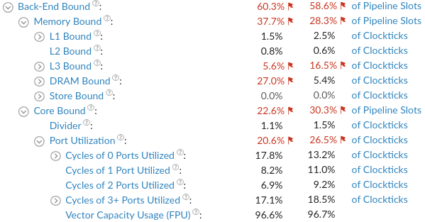

Top Down output shows that we have improved the port utlization with unrolling
and load and compute pipelining.

### Multi-Threading 



We are almost at the end. So far all the optimizations we did were for improving
the single threaded performance of a matrix tile/ block multiplication. Using
multiple threads we can compute several matrix tiles parllelly. For this, we can
parallelize the outer-most for loop where each iteration of it (i.e: a block
computation) happens in a separate thread. Here, I use OpenMP parallel for
pragma in order to simply parallelize this loop.


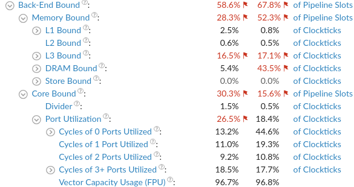

{% include marginnote.html title="Metrics" color="#ff009b"
content="<p style=\"margin-left:5px;margin-bottom:0px;\">Time(s) &nbsp; &nbsp;
&nbsp; &nbsp; : 10.20 &nbsp;
<i class=\"arrow-down\" style=\"--color:green;--size:8px;\"></i></p>
<p style=\"margin-left:5px;margin-top:0px;margin-bottom:0px;\">CPI &nbsp; &nbsp;
&nbsp; &nbsp; &nbsp; &nbsp; &nbsp; &nbsp;: 1.844 &nbsp;
<i class=\"arrow-up\" style=\"--color:red;--size:8px;\"></i></p>
<p style=\"margin-left:5px;margin-top:0px;\">(impl/base) : 2.36x &nbsp;
<i class=\"arrow-down\" style=\"--color:green;--size:8px;\"></i></p>
"%}

Top Down output indicates that by parallelizing it, we have reduced per thread
cpu utlization since now there is increased memory contention from multiple
threads. However we reduce the overall run time to `10.20` seconds. This is a
respectable `80x` performance improvement from where we started. However, we are
still a `2.36x` slower than the blas implementation; which speaks to how highly
tuned the blas implementation is. 


The final implementation still features a lot of memory contention. I think a good 
next step could be to investigate better blocking techniques so that we can leverage 
optimizations like prefetching and aggressive instruction pipelining. An 
interesting jumping off point for further inspiration could be the work on
<a href="https://dl.acm.org/doi/abs/10.1145/2764454?casa_token=e8wg7f7J3xAAAAAA:ynjmBdOvHi9P0kODSKVRb_IacRNU_9JK6XuKbeJ1hsErSHddnFB438qjWH7SjW2e3RSx7fVQsD_m">BLIS</a> which is fairly recent work in this space.
