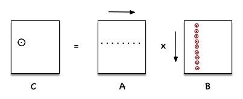

## Introduction

Matrix multiplication (in general `dgemm` in BLAS) is one of the most
performance critical compute kernels operating at the heart of many scientific
computing and deep learning workloads. While highly optimized BLAS
implementations of this kernel are available, it is still useful to
understand some of the typical optimizations which can be used to improve a
naive matrix multiplication implementation. In this article I am going to look
in to how we can optimize a matrix multiplication kernel on x86 starting from a
naive implementation. I am going to use Top Down performance analysis which is
available within Intel Vtune profiler and observe performance characterisitcs of
the kernel at each stage and drive the optimizations accordingly. I have covered
Top Down in a previous article which also contains many good references on how
to get started with it. The idea here is to illustrate how we can use this
method to drive optimizations, using matrix multiplication as a case study.
Beating existing highly tuned `dgemm` kernels is a non goal for this article. 

## Setup

The hardware is i7, 64GB memory, running Linux xyz with hyperthreading on.  The
code is compiled with g++ version xyz at -O3 optimization level.

## Optimizations

I start with the naive implementation featuring three nested loops as below.
Going forward I use this implementation as the base line.

[Figure]

When run with Top Down enabled, it gives the following output. 

{% include marginnote.html title="Metrics" 
content="
Time(s): -5% 
<i class=\"arrow-down\" style=\"--color:red;--size=8px\"></i>

CPI: 5% 
<i class=\"arrow-up\ style=\"--color:green;--size=8px\"></i>
"%}

<!--
"

Time(s): -5%

         

CPI : 5%
" 
-->

Implementation is severely memory bound as evident from XYZ entries. The
matrices are in row-major order. So every access to matrix B going down the
column is going to incur a high amount of last level cache misses in the
inner-most loop. Only one element of a fetched cache line of B is used in the
computation at a time and then potentially tossed off the cache which will be
refeteched when computing the next row adajcent cell of C (going right). 

We need to optimise the memory access pattern here in order to maximise the
amount of computation done before relinquishing a fetched cache line from B.

### Tiling (Blocking)

With matrix tiling (aka blocking) we fetch block of each matrix at a time and
carry out multiplication at block level. The fetched blocks are mostly served
from the fast memory (caches) and we reduce the number of main memory accesses
incured per floating point operation.

[Figure]

The code now features six nested loops with three inner loops operating at
block level.



With this optimization we have reduced the run-time by 3X. Top down output
confirms that we have reduced the last level cache misses and resultant
instruction stalls as evident from reduced CPI (x% reduction). 

